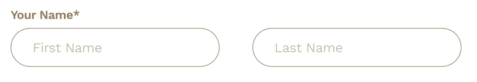

# Project Retrospective

Here are some learnings from the project that I currently have, due to the NDA, I can't share the whole project, but I can share some of the learnings and part of the codes that I have from the project.

<details>

<summary>Next.js: Dynamic Metadata</summary>

## Dynamic Metadata

- [Metadata](https://nextjs.org/docs/app/building-your-application/optimizing/metadata)

Metadata is the API that can be used to describe the content of a page. It is used by search engines, social media, and messaging services to get a preview of the content.

In Next.js, there are two ways to add metadata to a page:

- Config-based Metadata.(We were using this one)
- File-based Metadata.

## The Metadata object

- [Metadata Object and generateMetadata Options](https://nextjs.org/docs/app/api-reference/functions/generate-metadata)

Define Metadata Object from `layout.tsx` file.

There are some fields that are required for the Metadata object:

- `title`
- `template`(optional): Can be added a prefix or a suffix to titles defined in child routes.
- `description`(optional)
- `default` - A fallback title to child routes that don't have their own title.
- `absolute`: Provide a title that ignores `title.template`.

## Project retro

When I tried to implement dynamic metadata, there was an issue that I needed to fix:

- my root `layout.tsx` was not server component due to the `BottomNavbar.tsx` component that needed to be detected in order to show the bottom navbar.

### How to fix it?

Previously, `BottomNavbar.tsx` was an uncontrolled component, since I needed my root `layout.tsx` to be server component, I've decided to make `BottomNavbar.tsx` a controlled component.

essentially, the `BottomNavbar` would be hidden when the user scrolls down, and it would be shown when the user scrolls up. Here the states were passed from the root `layout.tsx` as props to the `BottomNavbar.tsx` component.

```typescript
// layout.tsx: Client component
// BottomNavbar: Uncontrolled component

"use client";

import * as React from "react";

const workSans = Work_Sans({ subsets: ["latin"] });

export default function RootLayout({
	children,
	params: { lang },
}: {
	children: React.ReactNode;
	params: ServerSidePageType["params"];
}) {
	const pathName = usePathname();
	const [scrollingDown, setScrollingDown] = React.useState(true);
	const [navbarVisible, setNavbarVisible] = React.useState(true);

	const timeoutIdRef = React.useRef<NodeJS.Timeout | null>(null);

	React.useEffect(() => {
		const handleScroll = () => {
			const isScrollingDown = window.scrollY > (scrollY || 0);
			setScrollingDown(isScrollingDown);

			if (timeoutIdRef.current) {
				clearTimeout(timeoutIdRef.current);
			}

			timeoutIdRef.current = setTimeout(() => {
				const shouldShowNavbar = isScrollingDown || window.scrollY === 0;
				setNavbarVisible(shouldShowNavbar);
			}, 150);
		};

		window.addEventListener("scroll", handleScroll);

		return () => {
			window.removeEventListener("scroll", handleScroll);
			if (timeoutIdRef.current) {
				clearTimeout(timeoutIdRef.current);
			}
		};
	}, []);

	return (
		<html lang={lang} dir={dir(lang)}>
			<body className={`${workSans.className} relative bg-MainBG`}>
				<ReduxProvider>
					<PopUpBanner />
					<Header lang={lang} />
					{navbarVisible && (
						<BottomNavbar path={pathName} scrollDown={scrollingDown} />
					)}
					{children}
					<Footer lang={lang} hideFooter={false} />
				</ReduxProvider>
			</body>
		</html>
	);
}
```

### Making BottomNavbar a controlled component

```typescript
// layout.tsx
// Change to Server component by not specifying "use client"

const workSans = Work_Sans({ subsets: ["latin"] });

export default function RootLayout({
	children,
	params: { lang },
}: {
	children: React.ReactNode;
	params: ServerSidePageType["params"];
}) {
	return (
		<html lang={lang} dir={dir(lang)}>
			<body className={`${workSans.className} relative bg-MainBG`}>
				<ReduxProvider>
					<PopUpBanner />
					<Header lang={lang} />
					<BottomNavbar />
					{children}
					<Footer lang={lang} hideFooter={false} />
				</ReduxProvider>
			</body>
		</html>
	);
}
```

```typescript
// BottomNavbar.tsx
"use client";

import * as React from "react";

export const BottomNavbar = () => {
  const path = usePathname();
  const [scrollingDown, setScrollingDown] = React.useState(true);
  const [navbarVisible, setNavbarVisible] = React.useState(true);

  const timeoutIdRef = React.useRef<NodeJS.Timeout | null>(null);

  React.useEffect(() => {
    const handleScroll = () => {
      const isScrollingDown = window.scrollY > (scrollY || 0);
      setScrollingDown(isScrollingDown);

      if (timeoutIdRef.current) {
        clearTimeout(timeoutIdRef.current);
      }

      timeoutIdRef.current = setTimeout(() => {
        const shouldShowNavbar = isScrollingDown || window.scrollY === 0;
        setNavbarVisible(shouldShowNavbar);
      }, 150);
    };

    window.addEventListener("scroll", handleScroll);

    return () => {
      window.removeEventListener("scroll", handleScroll);
      if (timeoutIdRef.current) {
        clearTimeout(timeoutIdRef.current);
      }
    };
  }, []);

  const maximumNum = (amount: number) => {
    ...
  };
  const location = path.split("/")[2];


  return (
    <>
      {navbarVisible ? (
        <nav
          className={`${
            location === "maintenance" || (location === "error-oops" && scrollingDown) ? "hidden" : "visible fixed"
          } bottom-0 z-[999] w-full bg-primaryGold md:hidden `}
        >
          <ul className="flex justify-between px-[18px] pt-[16px] sm:justify-around">
            ...links
          </ul>
        </nav>
      ) : null}
    </>
  );
};
```

Now my `layout.tsx` was server component, and I was able to implement dynamic metadata.

Example of using dynamic metadata:

```typescript
// layout.tsx

export const metadata: Metadata = {
	title: {
		default: "Brand",
		template: "%s | Brand Name",
	},
	description: "...",
	keywords: "...",
};
```

```typescript
// terms-condition/page.tsx

export const metadata: Metadata = {
	title: "Terms & Conditions",
};
```

The result would be `Terms & Conditions | Brand Name`.

</details>

<details>
<summary>Next.js: Fetch API</summary>

</details>

<details>
  <summary> Complicated Form </summary>

## Design a input component that can be applied to different situations

### The problem

When it comes to form, there are many different types of components. In order to design dynamic components that can be applied to multiple scenario, we need to consider the following things:

- Types of input(checkbox, radio, text, number, email, password, etc.)
- Warning / Success messages / icons
- States of input / select / buttons, etc (focus, valid, invalid, disabled, etc.)
- Actions of input (onchange, onblur, onfocus, etc.)

Following were the input / select / buttons, etc, `registration information` that required user to fill in in my project:

- title (chip when big screen, select when small screen)
- First name (input)
- Last name (input)
- Email (input)
- confirm email (input)
- mobile with no country codes. (input)
- Country (selector)
- Preferred language (chip)
- gender (chip)
- Birthday Month (selector)
- Birthday Year (selector)

But there won't be only one form in the project, there will be many different forms, following were the other forms that required user to fill in:

`Contact form`:

- title (chip when big screen, select when small screen)
- First name (input)
- Last name (input)
- Email (input)
- Mobile with default country code (input)
- member number (input)
- Enquiry (selector)
- Details of enquiry (input)
- Message (textarea)
- image upload (input)

`Campaign form`:

- title (chip when big screen, select when small screen)
- First name (input)
- Last name (input)
- Mobile with default country code (input)
- Email (input)
- Type of event (selector)
- Event Date (input)
- Event Time (hr and min) (selector)
- No. of Guests (chip)
- Company Name (input)
- Budget (input)
- Message (textarea)

## A standard input

A standard input would be like this:

```html
<label for="">XXX</label> <input id="" placeholder="" type="" />
```

Or in React:

```javascript
<label htmlFor="">XXX</label>
<input id="" placeholder="" type="" />
```

## Prepare constants

There are two ways to prepare constants:

- Make an `array` of inputs with series of information in it.
- Make multiple `objects` of inputs with series of information in it.

First of all, let's define types/interface first.

```typescript
// types.ts

export type InputType =
	| "text"
	| "email"
	| "password"
	| "number"
	| "tel"
	| "checkbox"
	| "radio";

export interface Input {
	labelFor: string; // for attribute of label
	labelText: string; // text of label
	name: string; // name of input
	autocomplete: string; // autocomplete attribute of input
	id: string; // id of input
	placeholder: string; // placeholder of input
	type: InputType; // type of input
	required: boolean; // required attribute of input
	disabled: boolean; // disabled attribute of input
	errorMessages: string; // error messages of input
	successMessages: string; // success messages of input
	warningIcon: React.ReactNode; // warning icon of input
	successIcon: React.ReactNode; // success icon of input
	onChange: (e: React.ChangeEvent<HTMLInputElement>) => void; // onchange event of input
	onKeyDown: (e: React.KeyboardEvent<HTMLInputElement>) => void; // onkeydown event of input
}
```

With the types/interface defined, we can prepare constants now.

```typescript
// constants.ts
// Separate the constants
import { Input, InputType } from "./types";

export const inputTypes: InputType[] = [
  "text",
  "email",
  "password",
  "number",
  "tel",
  "checkbox",
  "radio",
];

export firstName:Input = {
  labelFor: "firstName",
  labelText: "Your Name*",
  name: "firstName",
  autocomplete: "given-name",
  id: "firstName",
  placeholder: "First Name",
  type: "text",
  required: true,
  disabled: false,
  errorMessages: "Wrong format",
  successMessages: "",
  warningIcon: <WarningIcon />, // Or <Image src={warning} width={0} height={0} alt="Warning icon, wrong format"/>
  successIcon: <SuccessIcon />, // Or <Image src={check} width={0} height={0} alt="Success icon, correct format"/>
  onChange: (e: React.ChangeEvent<HTMLInputElement>) => {
    ...
  },
  onKeyDown: (e: React.KeyboardEvent<HTMLInputElement>) => {
    ...
  },
};

export lastName:Input = {
  labelFor: "lastName",
  labelText: "",
  name: "lastName",
  autocomplete: "family-name",
  id: "lastName",
  placeholder: "Last Name",
  type: "text",
  required: true,
  disabled: false,
  errorMessages: "Wrong format",
  successMessages: "",
  warningIcon: <WarningIcon />, // Or <Image src={warning} width={0} height={0} alt="Warning icon, wrong format"/>
  successIcon: <SuccessIcon />, // Or <Image src={check} width={0} height={0} alt="Success icon, correct format"/>
  onChange: (e: React.ChangeEvent<HTMLInputElement>) => {
    ...
  },
  onKeyDown: (e: React.KeyboardEvent<HTMLInputElement>) => {
    ...
  },
};

export email:Input = {
  labelFor: "email",
  labelText: "Email*",
  name: "email",
  autocomplete: "email",
  id: "email",
  placeholder: "Email",
  type: "email",
  required: true,
  disabled: false,
  errorMessages: "Wrong format of email",
  successMessages: "Email is valid",
  successMessages: "",
  warningIcon: <WarningIcon />, // Or <Image src={warning} width={0} height={0} alt="Warning icon, wrong format"/>
  successIcon: <SuccessIcon />, // Or <Image src={check} width={0} height={0} alt="Success icon, correct format"/>
  onChange: (e: React.ChangeEvent<HTMLInputElement>) => {
    ...
  },
  onKeyDown: (e: React.KeyboardEvent<HTMLInputElement>) => {
    ...
  },
};

// Repeat the same for other inputs
```

```typescript
// constants.ts
// Combine the constants into an array

import { Input, InputType } from "./types";

export const inputTypes: InputType[] = [
  "text",
  "email",
  "password",
  "number",
  "tel",
  "checkbox",
  "radio",
];

export const Registration:Input[] = [
  {
    labelFor: "firstName",
    labelText: "Your Name*",
    name: "firstName",
    autocomplete: "given-name",
    id: "firstName",
    placeholder: "First Name",
    type: "text",
    required: true,
    disabled: false,
    errorMessages: "Wrong format",
    successMessages: "",
    warningIcon: <WarningIcon />, // Or <Image src={warning} width={0} height={0} alt="Warning icon, wrong format"/>
    successIcon: <SuccessIcon />, // Or <Image src={check} width={0} height={0} alt="Success icon, correct format"/>
    onChange: (e: React.  ChangeEvent<HTMLInputElement>) => {
    ...
    },
    onKeyDown: (e: React.KeyboardEvent<HTMLInputElement>) => {
    ...
    },
  },
  {
    labelFor: "lastName",
    labelText: "",
    name: "lastName",
    autocomplete: "family-name",
    id: "lastName",
    placeholder: "Last Name",
    type: "text",
    required: true,
    disabled: false,
    errorMessages: "Wrong format",
    successMessages: "",
    warningIcon: <WarningIcon />, // Or <Image src={warning} width={0} height={0} alt="Warning icon, wrong format"/>
    successIcon: <SuccessIcon />, // Or <Image src={check} width={0} height={0} alt="Success icon, correct format"/>
    onChange: (e: React.ChangeEvent<HTMLInputElement>) => {
    ...
    },
    onKeyDown: (e: React.KeyboardEvent<HTMLInputElement>) => {
    ...
    },
  },
  {
    labelFor: "email",
    labelText: "Email",
    name: "email",
    autocomplete: "email",
    id: "email",
    placeholder: "Email",
    type: "email",
    required: true,
    disabled: false,
    errorMessages: "Wrong format of email",
    successMessages: "",
    warningIcon: <WarningIcon />, // Or <Image src={warning} width={0} height={0} alt="Warning icon, wrong format"/>
    successIcon: <SuccessIcon />, // Or <Image src={check} width={0} height={0} alt="Success icon, correct format"/>
    onChange: (e: React.ChangeEvent<HTMLInputElement>) => {
    ...
    },
    onKeyDown: (e: React.KeyboardEvent<HTMLInputElement>) => {
    ...
    },
  }
]

export const Contact:Input[] = [
  // Same as above
]
```

Personally, I prefer the first way, since it is more readable and easier to maintain.

Let's take a look at the figma. Based on the design , we only have to define once, let's why there's no `labelText` for `last name`



</details>
